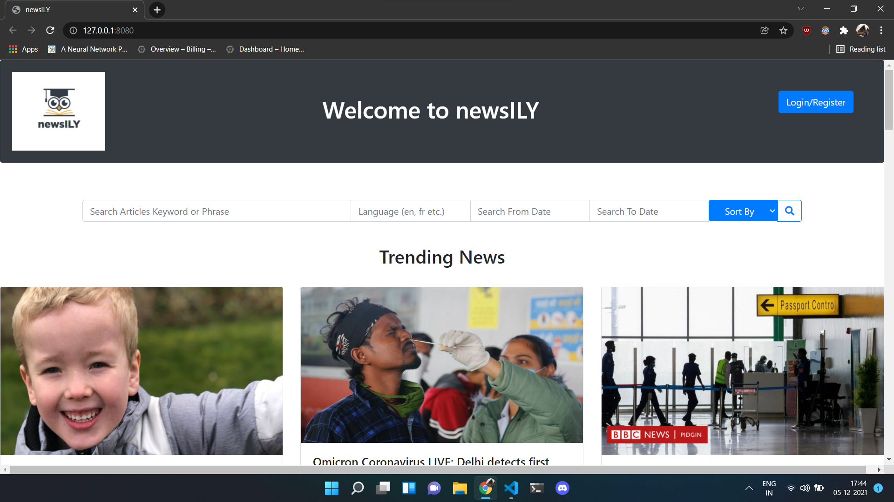
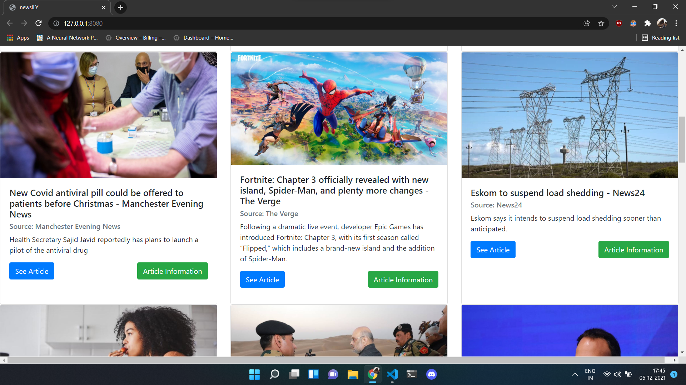
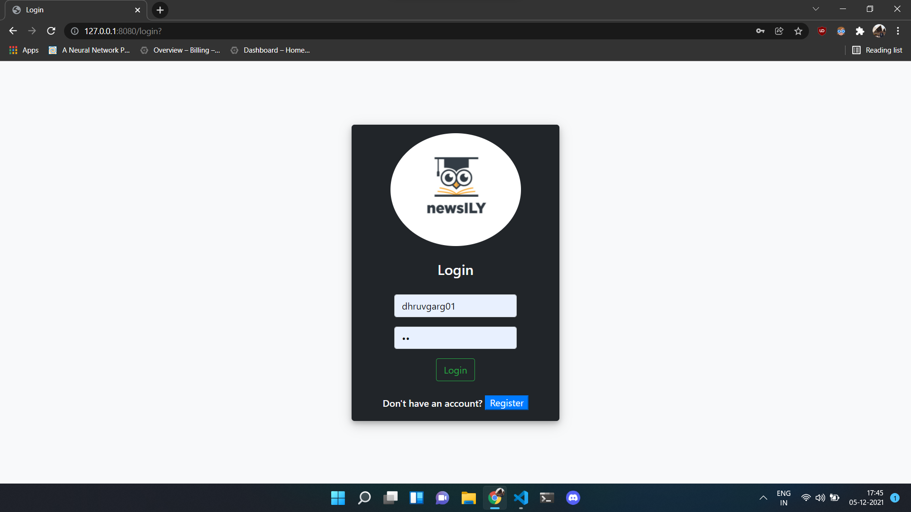
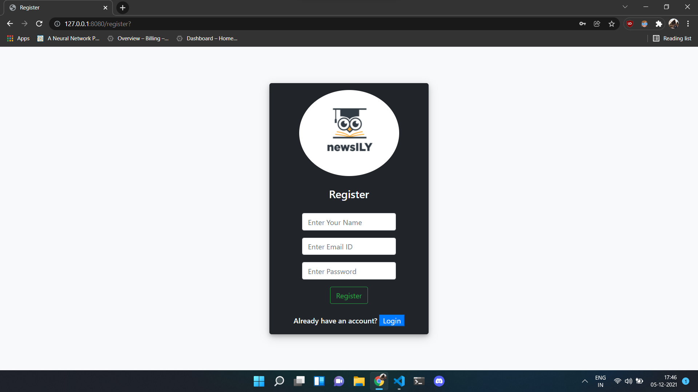
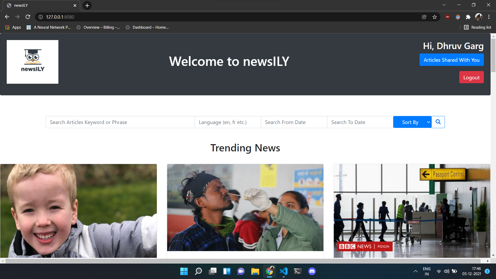
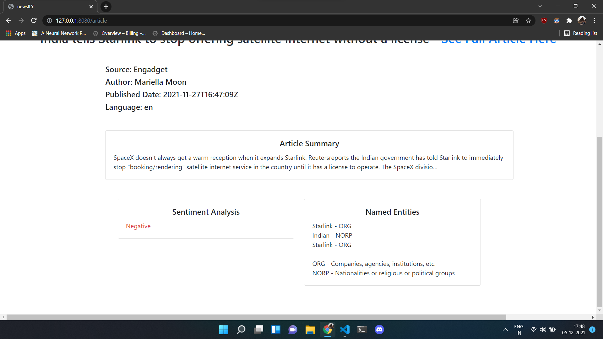
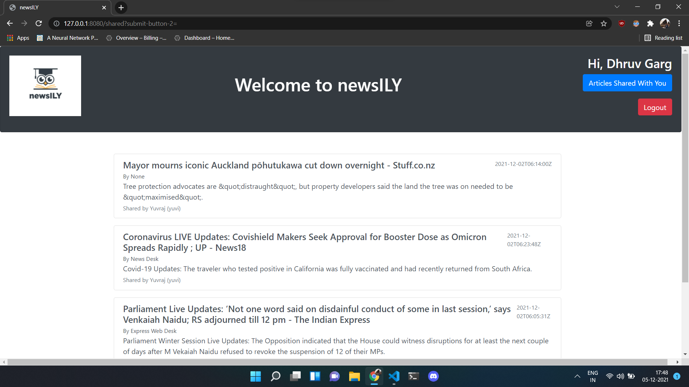

# Newsily
A website which allows its users to search for the most relevant news articles related to a particular topic. It uses NLP to extract important information from the news articles (NER), provides a summary of the news article and also performs sentiment analysis on the news article. This website can also keep track of users previous searches and recommend similar new search topics.

# Preview
|  |  |
|:---------------------|:---------------------|
|  |  |
|  |  |
|  |  |
|  | |